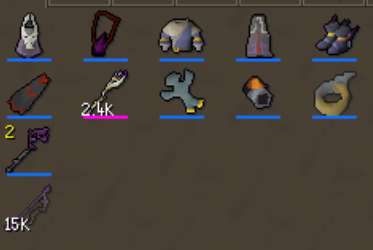
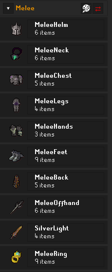
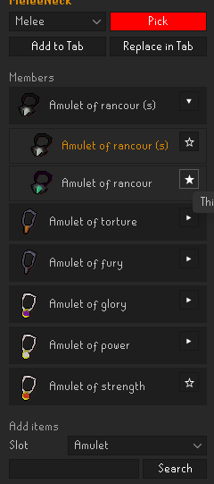
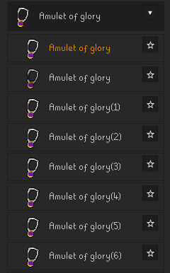
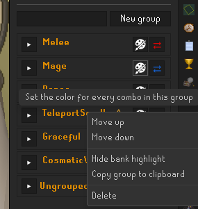
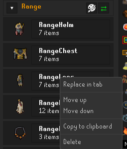
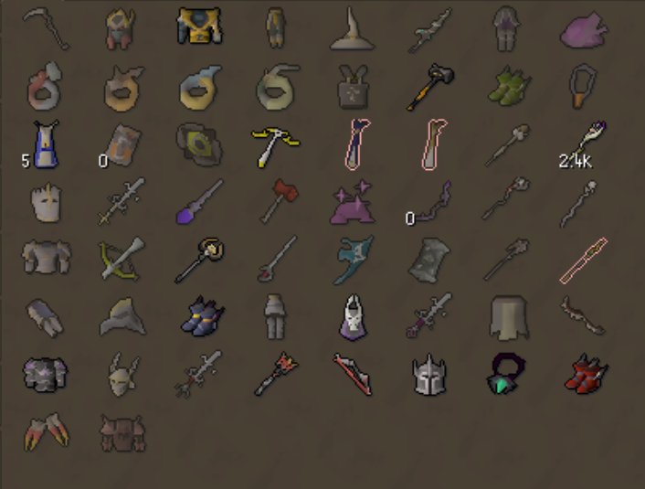
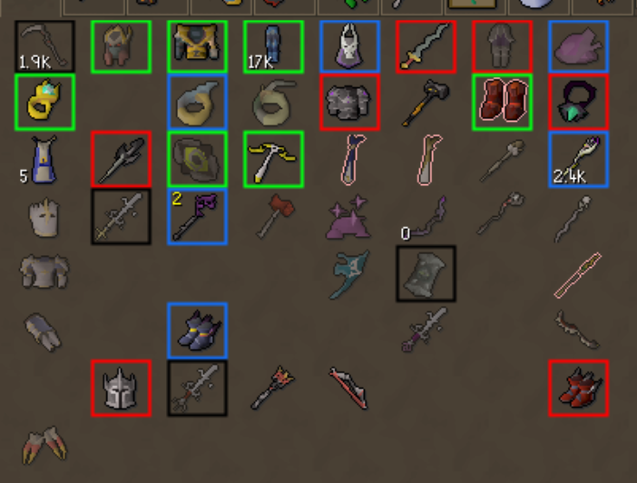

# Combo Tags

Customizable **smart "combo" cells** for your bank tag layouts.

A combo cell stands in for an ordered group of items — say every melee helm from Rune to
Torva. The cell automatically shows the **best item you currently own** from that group,
auto-rotating through an item's cosmetic / ornament / charged variants, so one bank slot
follows your gear progression instead of leaving you a row of upgrades to tidy by hand. Don't
own anything in the group yet? The cell shows a faded "ghost" of the goal item.

## Setup

Combo cells live inside **RuneLite's built-in bank tag layouts**:

1. Open the built-in **Bank Tags** side panel and create a tag tab.
2. Right-click the tab and choose **Enable layout**.
3. Open the **Combo Tags** side panel (this plugin) from the toolbar, build a combo, and add
   it to the open tab.

## Using Combo Tags

### Open the panel

Click the **Combo Tags** button in the RuneLite sidebar. The panel lists your combos,
organized into collapsible **groups**.

### Build a combo

Type a name and click **Create**, then **click the combo to open its builder**. Search for
items in the **Add items** box and add them in priority order — the top of the list is the
most preferred. Drag members to reorder; the cell always shows the highest one you own. Star a
member to use it as the combo's icon, and pick a color for its bank highlight.

**Variants are automatic.** Add a single item and the plugin folds in its cosmetic, ornament,
and charged variants — add a Scythe of Vitur and the cell shows your Holy or Sanguine one; a
Dragon pickaxe shows whichever recolor you own. Expand a member to choose which variant it
displays, or to set a preference order.

### Organize into groups

Use **New group** to create a collapsible category, then file combos under it. A group shares
one color across its combos (the 🎨 button) and has a one-click **Replace group in tab** (the
⇄ button) that drops every combo in the group into the open tab at once.

### Right-click menus

Most actions live on right-click in the side panel:

- **Right-click a group header** → Move up / down, Hide or Show its bank highlight, Copy the
  whole group to your clipboard, or Delete it.

  

- **Right-click a combo** → Replace in tab, Move up / down, Copy to clipboard, or Delete.

  

### Add it to a bank tab

With a layout-enabled tag tab open, use **Add to Tab** from a combo's builder — or **Replace
in Tab** to consolidate loose member items already sitting in the tab into one cell. Use a
group's ⇄ button to drop a whole group in at once.

**Before** — a tab full of loose gear upgrades:

**After** — each ordered group collapsed into one combo cell that tracks your best item,
colored per group:

- The highlight **style** is configurable (outline, dot, underline, or fill) — the shots just
  above use outlined boxes, while the one at the top uses underlines.
- Turn the highlight **off** for one combo (the builder's **Highlight in bank** checkbox) or a
  whole group (right-click → **Hide bank highlight**) — the item still shows, just unmarked.
- Right-click a cell in the bank for **Edit** (open its builder), **Set Placeholder** (replace
  the cell with the item it currently shows), or **Remove Layout**.

### Share & import combos

Right-click a combo or group → **Copy to clipboard** for a share string, and use **Import from
clipboard** to paste them back. You can paste **several at once** — even a whole file of them.

**Ready-made combo sets:** a starter Range / Melee / Mage + cosmetics pack lives
[here](https://pastebin.com/q1zuy8b1) — copy the whole page, then hit **Import from clipboard**
to load them all in one go.
